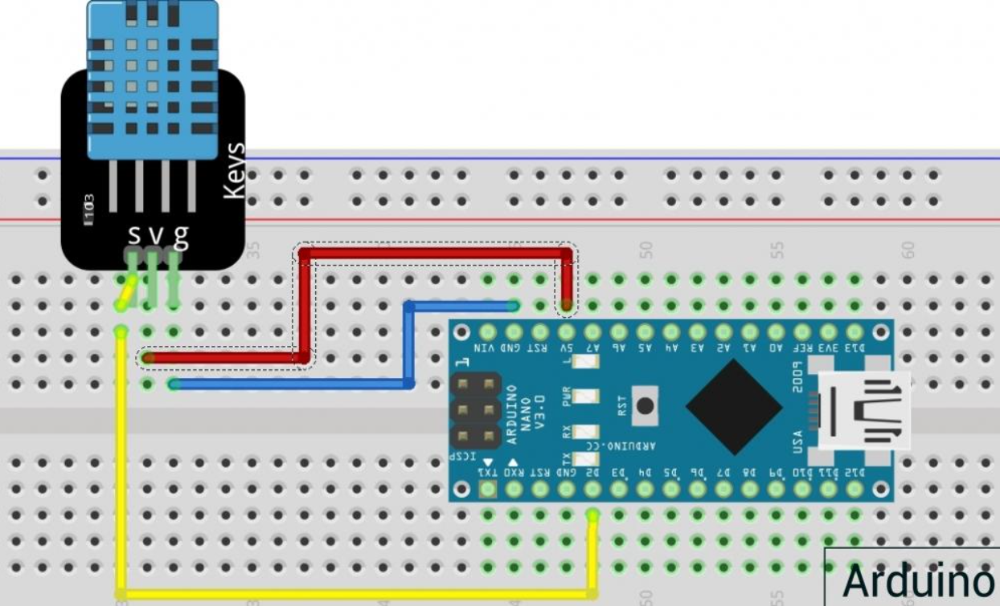

# Система мониторинга температуры и влажности с помощью Arduino и датчика DHT11

Java-приложение для сбора данных с датчика DHT11 через Arduino Nano и отправки уведомлений в Telegram Боте.

## Оглавление
- [Функциональность](#-функциональность)
- [Стек технологий](#-стек-технологий)
- [Структура проекта](#-структура-проекта)
- [Установка и запуск](#-установка-и-запуск)
- [Использование](#-использование)
- [Схема подключения](#-схема-подключения)

## Функциональность

- *Сбор данных* с датчика DHT11 через Arduino
- *Логирование показаний* в CSV-файл
- *Реальный мониторинг* в консоли
- *Telegram-бот* с уведомлениями каждые 2 часа
- *Автоматическое восстановление* при ошибках связи

## Стек технологий

### Аппаратная часть:
- Arduino Nano
- Датчик DHT11
- USB-кабель для данных

### Программная часть:
- **Java 11+** - основное приложение
- **Arduino IDE** - прошивка контроллера
- **Maven** - управление зависимостями
- **Telegram Bot API** - уведомления

### Библиотеки:
- `jSerialComm` - работа с COM-портом
- `Jackson Databind` - парсинг JSON
- `TelegramBots` - взаимодействие с Telegram

## Структура проекта
HomeMeteostation/  
├── src/main/java/ru/polikarpov/education/  
│ ├── Main.java # Основной класс приложения  
│ ├── SensorData.java # Модель данных датчика  
│ └── TelegramBotService.java # Сервис Telegram-бота  
├── meteostation_1.ino # Скетч для Arduino   
├── data.csv # Лог данных  
├── pom.xml # Конфигурация Maven  
└── README.md # Документация  

## Установка и запуск

### 1. Подготовка Arduino
1. Установите библиотеку DHT sensor library
2. Загрузите скетч meteostation_1.ino
3. Подключите DHT11:
-  VCC  → 5V
-  DATA → пин 2 (d2)
-  GND  → GND

## 2. Настройка Java-приложения
### Клонирование репозитория
git clone https://github.com/Runyk/HomeMeteostation.git  
cd HomeMeteostation

### Установка зависимостей
mvn clean install

## 3. Настройка Telegram-бота
Создайте бота через @BotFather

Получите токен от созданного Вами бота  

Узнайте Ваш chat_id через @userinfobot

Добавьте в Main.java:  
String botToken = "ТОКЕН_БОТА";  
String chatId = "ВАШ_CHAT_ID";

# Компиляция и запуск
mvn compile exec:java

# Или создание JAR-файла
mvn package
java -jar target/home-meteostation-1.0.jar

# Использование
Запуск приложения:
- Подключите Arduino к компьютеру

- Запустите Java-приложение

- Приложение автоматически:

- Найдет COM-порт Arduino

- Начнет сбор данных каждые 2 секунды

- Будет отправлять уведомления в Telegram каждые 2 часа

# Пример Консольного вывода
  Поиск Arduino...  
  Найден порт: COMn  
  Подключено к: COMn  
  [14:30:45] Температура: 22.5°C, Влажность: 45.0%  
  [14:30:47] Температура: 22.6°C, Влажность: 44.9%  

# Telegram уведомление
- 📊 Данные от Вашей метеостанции:  
  🌡 Температура: 22.5°C  
  💧 Влажность: 45.0%  
  ⏰ Время: 14:30:45

# Cхема подключения

# Формат данных
JSON от Arduino:
{"temperature": 22.5, "humidity": 45.0}

# Решение проблем
Не определяется Arduino:
1. Проверьте драйвер CH340
2. Используйте другой USB-порт
3. Проверьте кабель (должен быть для данных)

## Ошибка Telegram:
1. Токен бота (без слова "bot" в начале)
2. Chat ID (только цифры, не username)
3. Боту написан /start

## Нет данных в консоли:
1. Проверьте скорость порта (115200 бод)
2. Убедитесь что скетч загружен на Arduino
3. Проверьте правильность подключения датчика DHT11

# Возможности расширения
1. Веб-интерфейс (графики температуры/влажности)
2. Подключение базы данных
3. Уведомления при критических значениях
4. Мобильное приложение - удаленный мониторинг

## Автор
Runyk - разработчик
